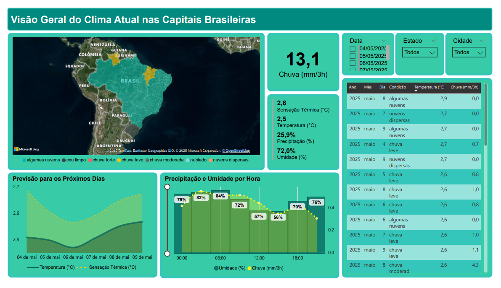

<h1 align="center">Previsão do Tempo nas Capitais Brasileiras</h1>

<p align="center">
  
  
  
  
</p>

<p align="center">
  Este projeto consome a <strong>API pública da OpenWeatherMap</strong> para coletar previsões climáticas das 27 capitais do Brasil para os próximos 5 dias (a cada 3h), organizando os dados em um DataFrame Pandas. Os dados incluem:
</p>

<ul>
  <li>🌆 Cidade e Estado</li>
  <li>📅 Data e Hora</li>
  <li>🌡️ Temperatura e Sensação Térmica</li>
  <li>💧 Umidade Relativa</li>
  <li>🌧️ Precipitação (mm/3h) e Probabilidade de Chuva</li>
  <li>☁️ Condições Climáticas em Português</li>
</ul>

---

<h2>📊 Visualização com Power BI</h2>

<p>Com os dados tratados, construí um dashboard interativo no Power BI para facilitar a análise de clima por região, dia e condições atmosféricas.</p>

<p align="center">
  
</p>

---

<h2>🚀 Como executar</h2>

```bash
# Clone o repositório
git clone https://github.com/seu-usuario/previsao-tempo-brasil.git
cd previsao-tempo-brasil

# Instale as dependências
pip install pandas requests

# Execute o script
python previsao.py
```

<h2>🔑 Requisitos</h2>
<ul>
  <li> Python 3.10+</li>
  <li> Conta gratuita na OpenWeatherMap (para obter sua API KEY)</li>
  <li> Power BI Desktop (para abrir o dashboard)</li>
</ul>

<h2>📁 Estrutura do projeto</h2>

```bash
  ├── previsao.py               # Script principal
  ├── dashboard.pbix            # Power BI com visualizações
  ├── README.md                 # Este arquivo
```

<h2>📬 Contato</h2> <p> Se tiver dúvidas ou sugestões, fique à vontade para abrir uma <a href="https://github.com/SouzaLF/Previsao-do-Tempo-nas-Capitais-Brasileiras">issue</a> ou entrar em contato. </p>
